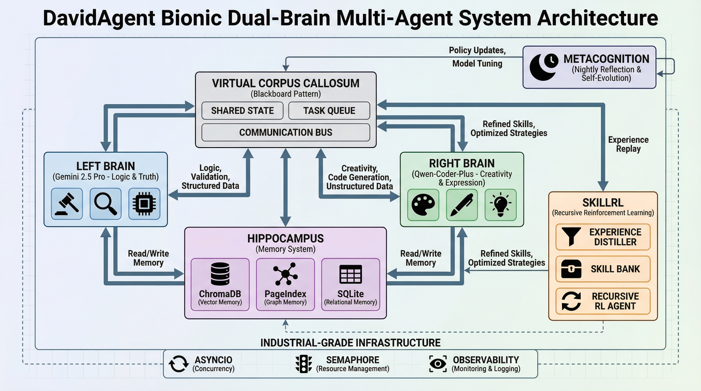

# DavidAgent：仿生双脑多智能体系统

## 概述

DavidAgent 代表了人工智能架构的革命性方法，灵感来源于人类认知的生物双脑模型。该系统实现了复杂的双脑架构，将逻辑推理与创造性表达分离，创造出一个能够自主处理信息、合成知识并生成内容的数字生命体，具有前所未有的可靠性和创造力。

系统的核心哲学是 **"技能胜过规模（Skills > Scale）"** —— 强调高质量、结构化的记忆和技能演进，而非仅仅依赖模型规模。通过实现递归技能增强强化学习（SkillRL），DavidAgent 能够从经验中持续学习，将成功的模式提炼成可重用的技能，并应用于不同上下文，甚至在不同语言模型之间转移。

## 架构组件

### 1. 左脑（逻辑与真理）
左脑作为系统的逻辑基础，由 Google 的 Gemini 2.5 Pro 模型驱动。其主要职责包括：
- **结构化知识提取**：使用 Pydantic 结构化输出从原始输入中高精度提取实体、关系和事实
- **事实验证**：实施红蓝对抗机制来交叉验证信息并防止幻觉
- **知识图谱构建**：构建和维护 PageIndex 知识图谱，捕捉概念间的语义关系
- **经验蒸馏**：分析任务结果以提取可重用的技能和模式存入技能库

左脑充当系统的免疫系统，确保所有生成内容在事实上的准确性和逻辑上的一致性。

### 2. 右脑（创造与表达）
右脑处理创造性任务和表达能力，由 Qwen-Coder-Plus（Q老师）驱动。其关键功能包括：
- **基于人设的内容生成**：根据特定人设或角色调整写作风格、语调和视角
- **上下文感知的创造力**：生成既具创造性又受左脑建立的事实边界约束的内容
- **动态提示注入**：管理复杂的提示工程并优化 Token 经济学
- **技能应用**：在内容生成任务期间加载和应用技能库中的相关技能

这种分工确保了创造力永远不会损害真理，而逻辑严谨性也不会扼杀创新。

### 3. 虚拟胼胝体（状态与通信）
虚拟胼胝体作为两个半球之间的通信桥梁，实现了黑板模式架构和异步事件驱动通信：
- **黑板模式**：共享状态空间，两个大脑都可以读写信息
- **事件驱动架构**：异步消息传递，允许独立操作同时保持协调
- **有限状态机**：编排从 IDLE → INGESTING → DRAFTING → REVIEWING → PUBLISHED → REFLECTING → COMPLETED 的完整工作流
- **冲突解决**：解决逻辑和创造性观点之间分歧的机制

这种架构确保了松耦合的同时保持两个认知系统之间的紧密协调。

### 4. 海马体（记忆与检索）
海马体管理系统的多层记忆架构：
- **语义记忆**：ChromaDB 向量数据库用于检索增强生成（RAG），支持语义相似性搜索
- **逻辑记忆**：PageIndex 双向 Markdown 知识图谱用于结构化关系存储
- **情景记忆**：SQLite WAL 模式数据库捕获完整的任务生命周期快照，包括输入、输出和中间状态
- **技能记忆**：分层技能库存储蒸馏后的技能，包含使用次数、成功率和人设关联等元数据

这种全面的记忆系统支持情景回忆和语义泛化。

### 5. 元认知与夜间反思
元认知层通过系统性反思实现自我进化：
- **夜间反思工作流**：自动分析每日表现以识别模式和改进机会
- **规则整合**：合并相似规则并修剪无效规则以维持系统效率
- **基于人类反馈的强化学习（RLHF）**：将人类反馈转化为可操作的系统改进
- **主动推理引擎**：主动识别知识缺口并启动深度思考过程

这创造了一个真正自我改进的系统，随时间不断进化。

### 6. SkillRL：递归技能演进
SkillRL 框架代表了 DavidAgent 最重要的创新：
- **经验蒸馏**：自动将任务轨迹（失败草稿、审查反馈、最终输出）转换为结构化技能
- **递归演进**：技能与强化学习过程共同演进，创建持续改进的反馈循环
- **跨模型迁移**：自然语言技能表示支持不同 LLM 之间的知识转移
- **Token 经济学优化**：通过用简洁的技能引用替换冗长指令，实现 10-20% 的 Token 压缩

SkillRL 将 DavidAgent 从静态代理转变为具有复杂任务"肌肉记忆"的学习有机体。

### 7. 工业级基础设施
该系统建立在稳健的、生产就绪的基础之上：
- **并发控制**：基于信号量的资源管理，具有防爆保护机制
- **弹性设计**：指数退避和断路器模式用于容错
- **可观测性**：全面的日志记录、监控和 Streamlit 可视化仪表板
- **安全性**：严格的权限控制和安全凭据管理

这确保了企业级的可靠性和性能。

## 完整文档目录

要探索完整的架构文档，请参考此目录中的各个章节文件：

- `00.Bionic_Dual_Brain_Architecture_TOC.md` - 完整目录
- `01.Vision_and_Core_Philosophy.md` - 愿景与核心哲学
- `02.System_Architecture_Overview.md` - 系统架构总览  
- `03.The_Left_Brain_Logic_and_Truth.md` - 左脑子系统
- `04.The_Right_Brain_Creation_and_Expression.md` - 右脑子系统
- `05.The_Corpus_Callosum_State_and_Communication.md` - 脑间通信
- `06.The_Hippocampus_Memory_and_Retrieval.md` - 记忆管理系统
- `07.Metacognition_and_Self_Evolution.md` - 自我反思与演进机制
- `08.SkillRL_Recursive_Evolution_and_Muscle_Memory.md` - 技能强化学习框架
- `09.Infrastructure_and_Resilience.md` - 工业级基础设施
- `10.Roadmap_and_The_Future.md` - 未来发展方向

DavidAgent 不仅代表了一个 AI 系统，更代表了一种构建可信赖、自演进数字智能的新范式，可以作为人类知识工作的真正伙伴。