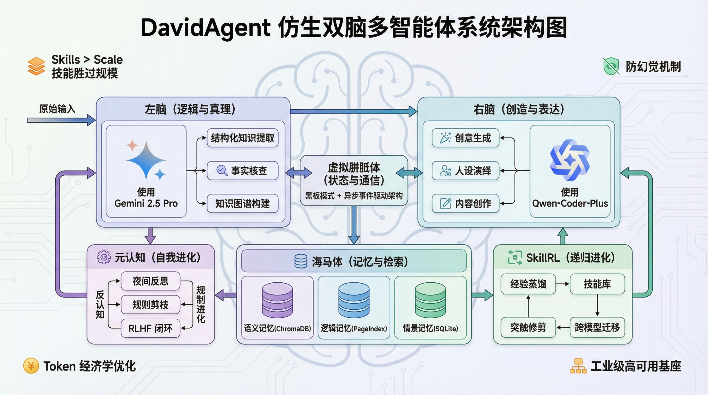

# DavidAgent：仿生双脑多智能体系统

## 系统概述

DavidAgent 是一个革命性的人工智能架构，灵感来源于人类认知的生物双脑模型。该系统实现了复杂的双脑架构，将逻辑推理与创造性表达分离，创建了一个能够自主处理信息、合成知识并生成内容的数字生命体，具有前所未有的可靠性和创造力。

## 核心组件

### 左脑（逻辑与真理）
- 结构化知识提取
- 事实核查与验证  
- 知识图谱构建
- 经验蒸馏

### 右脑（创造与表达）
- 人设演绎与降维打击
- 上下文感知创作
- 动态提示注入
- 技能应用

### 虚拟胼胝体（状态与通信）
- 黑板模式架构
- 异步事件驱动通信
- 有限状态机协调
- 冲突解决机制

### 海马体（记忆与检索）
- 语义记忆（ChromaDB向量数据库）
- 逻辑记忆（PageIndex知识图谱）
- 情景记忆（SQLite完整快照）
- 技能记忆（SkillBank）

### 元认知与夜间反思
- 夜间反思工作流
- 规则剪枝与合并
- 人类反馈强化学习
- 主动推理引擎

### SkillRL：递归技能进化
- 经验蒸馏机制
- 递归进化框架
- 跨模型迁移能力
- Token经济学优化

## 文档结构

完整的架构文档请参考本目录下的各个章节文件：

- `00.Bionic_Dual_Brain_Architecture_TOC.md` - 目录大纲
- `01.Vision_and_Core_Philosophy.md` - 愿景与核心哲学
- `02.System_Architecture_Overview.md` - 系统架构总览
- `03.The_Left_Brain_Logic_and_Truth.md` - 左脑：逻辑与真理
- `04.The_Right_Brain_Creation_and_Expression.md` - 右脑：创造与表达
- `05.The_Corpus_Callosum_State_and_Communication.md` - 虚拟胼胝体：状态与通信
- `06.The_Hippocampus_Memory_and_Retrieval.md` - 海马体：记忆与检索
- `07.Metacognition_and_Self_Evolution.md` - 元认知与自我进化
- `08.SkillRL_Recursive_Evolution_and_Muscle_Memory.md` - SkillRL：递归进化与肌肉记忆
- `09.Infrastructure_and_Resilience.md` - 工业级高可用基座
- `10.Roadmap_and_The_Future.md` - 未来演进路线图