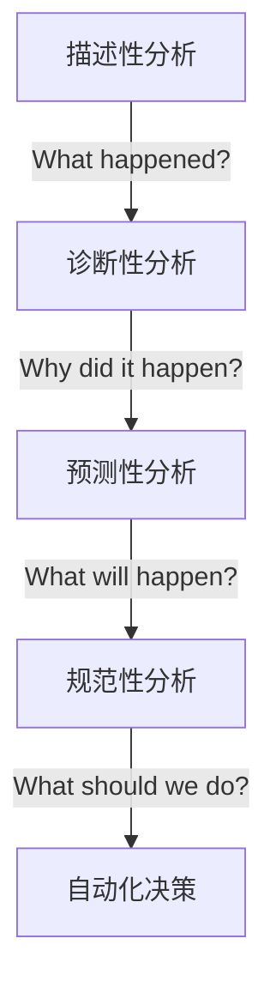
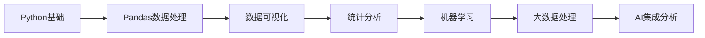

# 第一章：Python数据分析导论

## 🎯 学习目标

完成本章学习后，学生将能够：

- **理解** Python数据分析的基本概念和应用场景
- **掌握** 现代Python数据分析工具生态的核心组件
- **配置** 专业的数据分析开发环境
- **执行** 简单的数据分析任务并生成可视化结果
- **规划** 后续章节的学习路径

## 📊 1.1 什么是数据分析？

### 定义与重要性

**数据分析**是从原始数据中提取有价值信息的过程，它结合了统计学、计算机科学和领域专业知识。在2026年，数据分析已经成为：

- 🔬 **科学研究**的基础工具
- 💼 **商业决策**的核心支撑  
- 🏗️ **工程优化**的关键手段
- 🤖 **人工智能**的前置步骤

### 数据分析的四个层次



**教学重点**：强调从描述性分析到自动化决策的演进路径，让学生理解数据分析的完整价值链。

## 🛠️ 1.2 Python数据分析工具生态

### 核心库栈（2026年最新）

| 工具类别 | 主流库 | 特点 | 适用场景 |
|---------|--------|------|----------|
| **数据处理** | Pandas 3.0, Polars | 高性能、内存优化 | 结构化数据分析 |
| **数值计算** | NumPy 2.0, CuPy | GPU加速、向量化 | 科学计算 |
| **可视化** | Plotly, Seaborn | 交互式、美观 | 探索性分析 |
| **统计分析** | SciPy, Statsmodels | 统计检验、建模 | 假设验证 |
| **机器学习** | Scikit-learn, XGBoost | 算法丰富、易用 | 预测建模 |
| **大数据** | Dask, Vaex | 分布式、内存映射 | 大规模数据 |

### 工具选择原则

**教学建议**：
- 初学者优先掌握 **Pandas + Matplotlib/Seaborn**
- 进阶学习 **Polars**（性能优势）和 **Plotly**（交互性）
- 大数据场景引入 **Dask**

## 💻 1.3 开发环境配置

### 推荐配置方案

#### 方案一：本地开发（推荐）

```bash
# 创建虚拟环境
python -m venv data_analysis_env
source data_analysis_env/bin/activate  # Linux/Mac
# data_analysis_env\Scripts\activate   # Windows

# 安装核心包
pip install pandas==3.0.0 numpy==2.0.0 matplotlib seaborn plotly jupyterlab
```

#### 方案二：云端开发

- **GitHub Codespaces**：一键配置，团队协作
- **Google Colab**：免费GPU，快速原型
- **Kaggle Notebooks**：竞赛数据集，社区支持

### 环境验证代码

```python
import pandas as pd
import numpy as np
import matplotlib.pyplot as plt
import seaborn as sns

# 验证安装版本
print(f"Pandas version: {pd.__version__}")
print(f"NumPy version: {np.__version__}")

# 简单测试
df = pd.DataFrame({'x': range(10), 'y': np.random.randn(10)})
plt.figure(figsize=(8, 6))
sns.scatterplot(data=df, x='x', y='y')
plt.title('环境配置测试')
plt.show()
```

## 📈 1.4 第一个数据分析项目

### 案例：2026年AI发展趋势分析

让我们用真实数据来体验完整的数据分析流程：

```python
# 1. 数据加载
import pandas as pd

# 模拟AI投资数据
ai_data = pd.DataFrame({
    'year': [2022, 2023, 2024, 2025, 2026],
    'investment_billion': [30, 45, 68, 92, 120],
    'companies': [1200, 1800, 2500, 3200, 4100]
})

# 2. 数据探索
print(ai_data.info())
print(ai_data.describe())

# 3. 可视化分析
import matplotlib.pyplot as plt
import seaborn as sns

fig, (ax1, ax2) = plt.subplots(1, 2, figsize=(12, 5))

# 投资趋势
sns.lineplot(data=ai_data, x='year', y='investment_billion', marker='o', ax=ax1)
ax1.set_title('全球AI投资趋势 (2022-2026)')
ax1.set_ylabel('投资金额 (十亿美元)')

# 公司数量
sns.barplot(data=ai_data, x='year', y='companies', ax=ax2)
ax2.set_title('AI公司数量增长')
ax2.set_ylabel('公司数量')

plt.tight_layout()
plt.show()
```

### 分析结果解读

- **投资增长**：复合年增长率约 **41%**
- **市场扩张**：公司数量年均增长 **36%**
- **行业成熟度**：从早期探索进入规模化阶段

## 📚 1.5 学习资源与路径

### 推荐学习路径



### 优质资源

- **官方文档**：Pandas 3.0 Documentation
- **在线课程**：Coursera "Python for Data Science"
- **实践平台**：Kaggle, LeetCode 数据分析题
- **社区**：Stack Overflow, Reddit r/datascience

## 🏆 1.6 本章小结

### 关键知识点回顾

1. **数据分析定义**：从数据中提取价值的系统性过程
2. **工具生态**：Pandas为核心，多库协同的现代栈
3. **环境配置**：本地vs云端的选择策略
4. **实践入门**：完整的数据分析工作流
5. **学习路径**：循序渐进的技能发展路线

### 下章预告

第二章将深入 **Pandas数据处理**，涵盖：
- DataFrame和Series的核心操作
- 数据清洗与预处理技术
- 高级索引和分组操作
- 性能优化最佳实践

## 📝 教学建议

### 课堂活动设计

1. **环境配置竞赛**（15分钟）：学生快速配置环境并运行测试代码
2. **数据分析演示**（20分钟）：实时演示AI趋势分析案例
3. **小组讨论**（10分钟）：讨论数据分析在各自专业领域的应用
4. **动手练习**（25分钟）：完成简单的数据加载和可视化任务

### 常见问题解答

**Q: 为什么选择Pandas而不是其他工具？**
A: Pandas提供了最平衡的易用性、功能性和社区支持，是数据分析的事实标准。

**Q: 需要很强的数学背景吗？**
A: 基础统计学知识足够，重点在于理解和应用，而非理论推导。

**Q: 如何处理中文数据？**
A: Pandas 3.0对Unicode支持优秀，配合正确的编码设置即可。

---