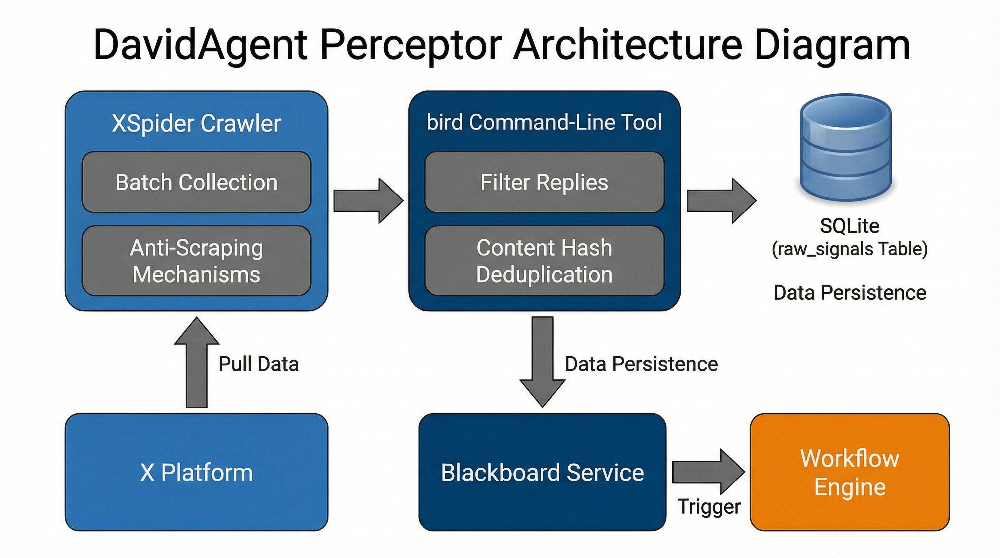
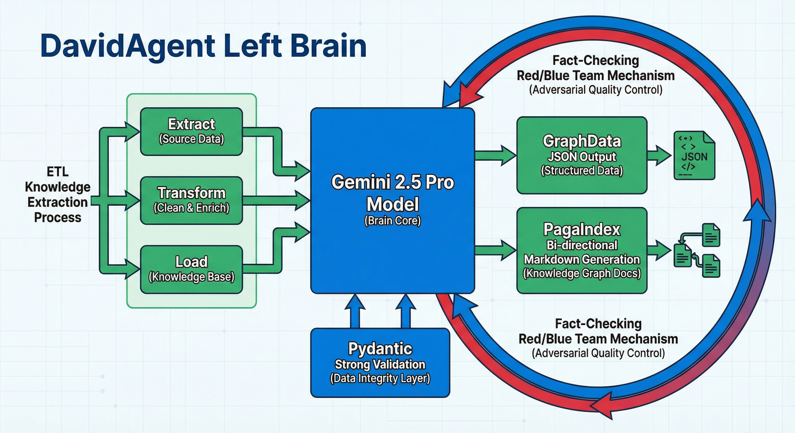

# DavidAgent 感知器与左脑代码运行机制详解

## 概述

DavidAgent 采用仿生双脑架构，其中**感知器（Sensors）**负责从外部世界采集原始数据，**左脑（Left Brain）**负责将这些数据转化为结构化的知识图谱并进行事实核查。本文档详细解析这两个核心组件的代码实现机制。



## 1. 感知器（Sensors）运行机制

### 1.1 架构定位

感知器是 DavidAgent 系统的"感官器官"，主要负责：
- 从 X/Twitter 平台抓取 AI 相关的文章和推文
- 过滤非文章内容（如短推文、回复等）
- 将原始数据推送到黑板（Blackboard）触发后续处理流程
- 实现数据去重和持久化存储

### 1.2 核心实现：XSpider 类

`XSpider` 类位于 `brain/sensors/x_spider.py`，是感知器的主要实现。

#### 1.2.1 数据抓取机制

```python
async def fetch_tweets_by_handle(self, handle: str, count: int = 5) -> List[Dict]:
    """抓取指定账号的最新推文"""
    cmd = ["bird", "search", f"from:{handle}", "-n", str(count), "--json-full"]
```

- 使用 `bird` 命令行工具作为底层数据源
- 支持批量抓取指定账号的最新推文
- 返回标准化的 JSON 格式数据

#### 1.2.2 内容过滤逻辑

```python
# 过滤回复 (Replies)
if in_reply_to:
    print(f"⏭️ [感知器-X] 过滤回复内容: {tweet_id}")
    continue

# 文章识别逻辑强化
is_article = False
if note_tweet or len(text) > 280:
    is_article = True
    
if not is_article:
    print(f"⏭️ [感知器-X] 过滤非文章内容 (短 POST): {tweet_id}")
    continue
```

- 自动过滤回复内容，避免噪声数据
- 通过 NoteTweet 标识或文本长度（>280字符）识别文章类型
- 只处理真正的长文内容，确保数据质量

#### 1.2.3 数据去重与持久化

```python
# 生成内容 Hash 用于去重
content_hash = hashlib.md5(text.encode('utf-8')).hexdigest()

# 检查去重
if db.check_duplicate(content_hash):
    print(f"⏭️ [感知器-X] 跳过重复内容 (Hash: {content_hash[:8]})")
    continue

# 永久保存原始信号到 SQLite (raw_signals 表)
db.save_raw_signal(signal_data)
```

- 使用 MD5 哈希值进行内容去重
- 将原始信号持久化存储到 SQLite 数据库
- 避免重复处理相同内容

#### 1.2.4 黑板集成

```python
# 推送到黑板触发下游 (Left/Right Brain)
if self.blackboard:
    self.blackboard.update('topic_id', signal_id := signal_data['signal_id'], 'SENSOR_X')
    self.blackboard.update('raw_source', text, 'SENSOR_X')
    self.blackboard.update('workflow_status', 'START', 'SYSTEM')
```

- 更新黑板状态，触发左脑和右脑的处理流程
- 设置 `workflow_status` 为 `START`，启动整个处理管道

### 1.3 批量处理机制

```python
async def batch_ingest(self, count_per_handle: int = 1):
    """
    批量抓取任务包 - 从 JSON 配置文件读取账号
    """
    # 从配置文件读取目标账号列表
    accounts = self.config.x_target_accounts
    
    for handle in accounts:
        await self.ingest_to_blackboard(handle, count_per_handle)
        await asyncio.sleep(10)  # 账号间休息，降低被风控风险
```

- 支持从配置文件批量读取目标账号
- 实现防风控机制（账号间休眠10秒）
- 自动化执行感知任务

## 2. 左脑（Left Brain）运行机制

### 2.1 架构定位

左脑是 DavidAgent 的"逻辑中枢"，具有双重身份：
1. **知识提取器**：将原始文本转化为结构化知识图谱
2. **事实核查员**：对右脑生成的内容进行事实验证



### 2.2 核心实现：LeftBrainGemini 类

`LeftBrainGemini` 类位于 `brain/left_brain/left_brain.py`，基于 Google Gemini API 实现。

#### 2.2.1 双阶段知识提取

左脑采用**两阶段提取策略**确保知识质量和准确性：

**第一阶段：探索模式（Exploration Mode）**
```python
# Pass 1: 探索与翻查 (Function Calling)
pass_1_prompt = f"""
你是一个极度理性的数据治理专家。你的任务是通读以下原始信号文本，
并判断其中是否包含你不确定的专有名词、系统组件或架构概念。
如果你遇到了本工程（DavidAgent）可能独有的名词，
请务必调用 `search_pageindex` 工具去查阅本地知识库，以便获得准确的定义。
"""
```

- 允许模型主动调用工具查询本地知识库
- 提供上下文理解，为第二阶段做准备
- 温度设置为 0.3，保留一定的创造性

**第二阶段：结晶模式（Crystallization Mode）**
```python
# Pass 2: 知识结晶 (Structured JSON Schema)
response2 = await asyncio.to_thread(
    chat.send_message,
    pass_2_prompt,
    config=types.GenerateContentConfig(
        response_mime_type="application/json",
        response_schema=GraphData,
        temperature=0.0  # 强制事实提取，关闭随机性
    )
)
```

- 强制输出符合 Pydantic Schema 的结构化数据
- 温度设置为 0.0，确保完全的事实导向
- 利用第一阶段的上下文进行精确提取

#### 2.2.2 Pydantic 数据契约

左脑使用严格的 Pydantic 模型定义数据结构：

```python
class Entity(BaseModel):
    name: str = Field(description="实体名称，极其精炼，去除所有修饰词。")
    type: str = Field(description="实体分类，如：'Framework', 'Concept', 'Tool'。")
    definition: str = Field(description="客观、冷静的实体定义，严禁包含主观赞美。")

class Triple(BaseModel):
    subject: str = Field(description="主语实体名称，必须与 entities 列表中的某一个 name 完全一致。")
    predicate: str = Field(description="谓词/关系，如 '依赖于', '属于', '对比'。")
    object_: str = Field(description="宾语实体名称，必须与 entities 列表中的某一个 name 完全一致。")
    context: str = Field(description="该关系成立的技术上下文或条件补充。")

class GraphData(BaseModel):
    entities: List[Entity] = Field(description="从文本中提取的核心实体列表。")
    triples: List[Triple] = Field(description="实体之间的核心逻辑关系三元组。")
    summary: str = Field(description="整段原始文本的客观技术摘要（150字以内）。")
```

- 通过类型注解确保数据结构的严格性
- 字段描述提供清晰的提取指导
- 避免传统 Prompt Engineering 的脆弱性

#### 2.2.3 PageIndex 持久化机制

```python
async def _save_to_pageindex(self, graph_dict: dict, source_id: str):
    """将 JSON 渲染为带有 [[实体]] 双链语法的 Markdown，存入本地知识库"""
    # ... 渲染 Markdown 内容 ...
    md_content = f"# 知识图谱: {topic_name}\n\n"
    md_content += f"> 摘要：{summary}\n\n"
    
    md_content += "## 核心实体 (Entities)\n"
    for entity in entities:
        md_content += f"- **[[{name}]]** ({e_type}): {definition}\n"
    
    md_content += "\n## 逻辑关系 (Triples)\n"
    for triple in triples:
        md_content += f"- [[{subject}]] == {predicate} ==> [[{obj}]]{context_str}\n"
```

- 将结构化数据转换为人类可读的 Markdown 格式
- 使用双链语法 `[[实体名称]]` 支持知识图谱可视化
- 存储在 `skills/self-learning-agent/pageindex/knowledge/` 目录
- 兼容 Obsidian、Logseq 等 PKM 工具

#### 2.2.4 事实核查机制（红蓝对抗）

左脑的第二重身份是事实核查员，实现红蓝对抗机制：

```python
async def review_draft(self, draft_content: str, ground_truth: dict) -> dict:
    """
    阶段二：红蓝对抗与事实核查 (Immune System)
    对比右脑草稿和真理字典，严格拦截幻觉。
    """
    prompt = f"你是一个严苛的事实核查法官。请对比【绝对真理字典】({json.dumps(ground_truth, ensure_ascii=False)}) 和【博客草稿】({draft_content})。如果有捏造实体或扭曲关系，必须判定不通过。"
    
    response = await asyncio.to_thread(
        self.client.models.generate_content,
        model=self.model_name,
        contents=prompt,
        config=types.GenerateContentConfig(
            response_mime_type="application/json",
            response_schema=FactCheckResult,
            temperature=0.0
        )
    )
```

**核查标准（零容忍原则）：**
1. **实体捏造**：草稿中提及图谱中不存在的实体
2. **关系错位**：主宾关系颠倒或关系类型错误  
3. **语气越界**：使用不符合科技达人角色的营销词汇

**反馈机制：**
```python
class FactCheckResult(BaseModel):
    passed: bool = Field(description="草稿是否 100% 符合事实？发现任何捏造实体或扭曲关系必须为 False。")
    feedback: str = Field(description="如果 passed 为 False，给出具体修改指令；如果 True，输出 'OK'。")
    hallucinations: List[str] = Field(description="列出所有捏造的具体知识点（无幻觉则为空）。")
```

- 严格的布尔判决，不允许模棱两可
- 具体的修改指导，支持自动修复
- 幻觉点的明确列举，便于调试

### 2.3 工作流集成

左脑通过监听黑板状态变化来触发处理：

```python
# 在 listener.py 中
def on_blackboard_update(key, value, source):
    if key == 'raw_source' and source == 'SENSOR_X':
        # 触发左脑知识提取
        asyncio.create_task(left_brain.extract_knowledge(value, topic_id))
    elif key == 'draft_content' and source == 'RIGHT_BRAIN':
        # 触发左脑事实核查
        asyncio.create_task(left_brain.review_draft(value, ground_truth))
```

- 事件驱动架构，响应黑板状态变化
- 异步处理，避免阻塞主流程
- 清晰的职责分离

## 3. 系统优势与设计哲学

### 3.1 工程优势

1. **可靠性**：Pydantic Schema + Gemini 原生结构化输出确保 100% 格式正确
2. **可维护性**：Markdown 格式的知识图谱便于人工审查和修正
3. **可扩展性**：模块化设计支持添加新的感知器类型（如 RSS、邮件等）
4. **抗幻觉**：红蓝对抗机制有效拦截大模型的偶发性幻觉

### 3.2 设计哲学

- **数据契约优于 Prompt Engineering**：用代码定义数据结构，而非依赖脆弱的提示词
- **人类可读优于机器优化**：选择 Markdown 而非数据库，确保知识对人类透明
- **自动化闭环优于人工干预**：红蓝对抗实现无人值守的质量保证
- **渐进式学习优于一次性处理**：通过 PageIndex 积累长期知识资产

## 4. 性能考量与优化

### 4.1 异步处理

- 感知器和左脑均采用异步实现，避免 I/O 阻塞
- 批量处理时实现合理的延迟控制，避免 API 限流

### 4.2 缓存机制

- 本地 PageIndex 作为知识缓存，减少重复提取
- SQLite 数据库实现高效的去重查询

### 4.3 错误处理

- 完善的异常捕获和日志记录
- 单个数据处理失败不影响整体流程

## 结论

DavidAgent 的感知器和左脑实现了从原始数据到结构化知识再到质量保证的完整 pipeline。通过结合现代大模型的能力与传统软件工程的最佳实践，构建了一个可靠、可维护、抗幻觉的智能信息处理系统。这种架构不仅适用于 AI 新闻聚合场景，也为其他需要高质量知识提取的应用提供了参考范式。