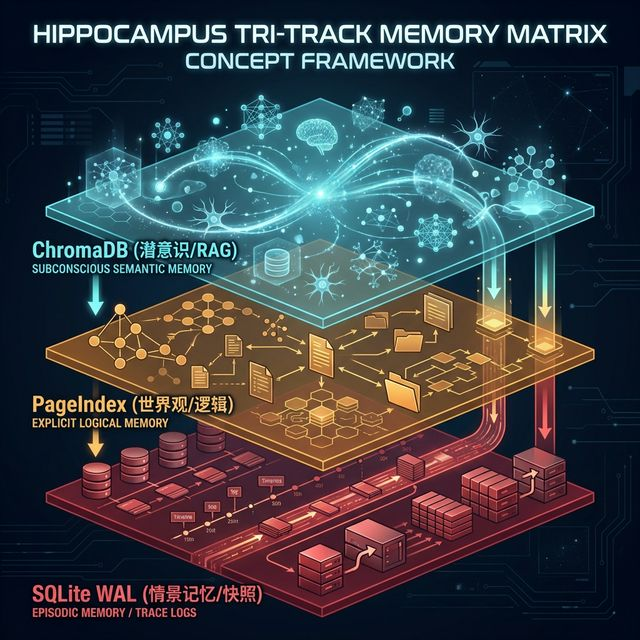

# DavidAgent：仿生双脑多智能体系统架构设计白皮书

## 第六章：海马体 (The Hippocampus) —— 记忆与检索

如果一个人工智能系统每次被唤醒时，都只能面对当前的输入，而对过去发生的一切毫无感知，那么它充其量只是一个“聪明的函数（Smart Function）”，永远无法进化为真正的“智能体（Agent）”。

在人类大脑中，海马体（Hippocampus）是负责将短期记忆转化为长期记忆，并进行空间与情景导航的核心器官。在 DavidAgent 的架构中，我们构建了一个**多维立体的物理存储矩阵**来充当海马体。它不仅要记住“知识”，还要记住“语境”，更要记住“自己曾经犯过的错误”。

本章将深入数据持久化的深水区，全面解构 DavidAgent 的三轨并行记忆系统：基于 ChromaDB 的语义记忆、基于 PageIndex 的逻辑记忆，以及基于 SQLite WAL 模式的情景记忆。我们将揭秘这些存储引擎如何协同工作，让你的数字分身拥有跨越时间的认知连续性。

---

### 6.1 语义记忆 (Semantic Memory)：ChromaDB 与向量检索 (RAG)

语义记忆是 Agent 的**“潜意识与联想网络”**。当右脑（千问）在构思一篇关于“大模型推理成本”的文章时，它需要能够“依稀记得”上个月曾经分析过 DeepSeek-V2 的 API 价格，并将其自然地融入当前的写作中。

为了实现这种跨周期的潜意识关联，我们引入了 ChromaDB 作为系统的本地向量数据库。



#### 6.1.1 向量化与知识切片 (Vectorization & Chunking)

左脑（Gemini）在完成知识图谱的提取后，会生成一段高度浓缩的 `summary`（例如：“本文对比了 Kimi 和 Doubao 在长文本处理上的 API 速率限制与计费差异”）。
海马体接收到这段摘要后，会调用 Embedding 模型（如 `text-embedding-v3` 或开源的 BGE 模型）将其转化为高维向量，并连同元数据（时间戳、实体标签、原始推文 ID）一起存入 ChromaDB 的 `semantic_collection` 中。

#### 6.1.2 潜意识召回机制 (Subconscious Retrieval via RAG)

当右脑准备开始创作时，海马体会执行一次标准的 RAG（检索增强生成）流程：

1. **查询生成**：使用当前任务的提取摘要作为 Query。
2. **相似度计算**：在 ChromaDB 中进行 KNN（K近邻）检索，寻找在多维空间中距离最近的 Top-K 历史记忆片段。
3. **动态注入**：将这些片段作为 `Historical_Context` 拼接到右脑的 System Prompt 中。

#### 6.1.3 进阶防污染：遗忘曲线与时间衰减 (Time-Decay Forgetting Curve)

在 AI 领域，技术迭代极快。一年前关于“如何配置 LangChain”的记忆，在今天可能已经是完全过时甚至有害的噪音（污染源）。
为了解决 RAG 系统的“记忆堆积污染”问题，DavidAgent 的海马体引入了**艾宾浩斯遗忘曲线（Ebbinghaus Forgetting Curve）**的工程实现：

* 在进行 ChromaDB 检索后，海马体会对召回的文档进行**二次打分（Re-ranking）**。
* 算法引入时间惩罚权重：距离当前时间越久远的记忆，其相似度得分会被扣减得越多。
* 除非一条一年前的记忆与当前的 Query 相似度达到极高的阈值（例如 0.95 以上的底层逻辑共鸣），否则它将被系统视为“遗忘的旧技术”而被静默过滤。这赋予了 Agent “喜新厌旧”的极客特质。

---

### 6.2 逻辑记忆 (Logical Memory)：PageIndex 的双链 Markdown 体系

如果 ChromaDB 是模糊的潜意识，那么 **PageIndex** 就是 DavidAgent 极其清晰、确定的**“世界观地图”**。它是系统的显性知识库（Explicit Knowledge Base）。

#### 6.2.1 抛弃图数据库的务实选择

在构建知识图谱时，业界通常的直觉是使用 Neo4j 等庞大的图数据库。然而，对于一个以文本生成为核心的个人数字分身来说，这种做法不仅运维成本极高，而且极难与 LLM 的上下文窗口无缝对接。

DavidAgent 选择了极其轻量且极具极客美学的方案：**基于文件系统的双链 Markdown 体系 (Double-Linked Markdown)**。

#### 6.2.2 PageIndex 的物理结构

左脑提取出的结构化 JSON（实体与三元组），会被海马体的转换器无损渲染为标准的 Markdown 文件，储存在 `skills/self-learning-agent/pageindex/knowledge/` 目录下。

```markdown
# 知识节点: Multi-Agent_Frameworks_2026
> 摘要：关于 Node.js 环境下多智能体框架的 I/O 优势分析。

## 实体字典 (Entities)
- **[[OpenClaw]]** (Framework): 事件驱动的本地 Agent 编排框架。
- **[[Spawn EBADF]]** (Error_Code): Node.js 在高并发子进程调用时常见的底层文件描述符耗尽错误。

## 关系拓扑 (Topology)
- [[OpenClaw]] == 规避了 ==> [[Spawn EBADF]] *(补充: 通过单一进程内的事件总线替代子进程挂载)*

```

#### 6.2.3 双链体系的巨大优势

1. **人类与 AI 的共享界面**：这是一种人类可读、LLM 易解析的格式。你甚至可以直接用 Obsidian 打开这个目录，Obsidian 会自动将这些带有 `[[ ]]` 的标签渲染成一张璀璨的星空图（Graph View）。人类可以直观地看到 DavidAgent 脑海中的知识宇宙是如何随着时间扩张的。
2. **图谱涌现的基础**：这为系统后期的“主动思考（Proactive Thinking）”提供了完美的遍历数据源。周末闲暇时，系统可以扫描这些 Markdown 文件，通过提取交叉出现的 `[[实体]]`，自行领悟出隐藏的技术趋势。

---

### 6.3 情景记忆 (Episodic Memory)：SQLite WAL 模式与完整生命周期快照

智能体要实现自我进化，必须拥有反思能力；而反思的前提，是必须极其精确地记住“昨天我是怎么失败的”。这就是**情景记忆（Episodic Memory）**——即 Agent 的“自传体日记”。

#### 6.3.1 为什么是 SQLite 而不是 Elasticsearch？

为了记录日志，企业级架构喜欢用 ELK 栈。但 DavidAgent 的设计哲学是“去中心化、高内聚”。Python 原生支持的 SQLite 单文件数据库，配合 JSON 字段，是记录系统状态机流转最轻量、最坚固的保险箱。

#### 6.3.2 记录完整的生命周期 (Trace Logs)

在黑板（Blackboard）的状态机走到终点（无论是 `PUBLISHED` 还是 `ERROR`）时，海马体会执行一次全量快照（Snapshot）备份。
存入 SQLite `trace_logs` 表的数据不仅包含时间戳和状态，更包含了极其详尽的上下文：

* `raw_source`：当时抓取的那条肮脏的推文到底长什么样。
* `left_brain_graph`：左脑当时提炼出的 JSON 是什么。
* `right_brain_draft`：右脑生成的初稿（即便是充满幻觉的错误版本）。
* `review_feedback`：左脑毫不留情的驳回意见。
* **上帝视角快照**：整个黑板字典的 `json.dumps()` 完整字符串。

这些详尽的案发现场记录，为后期的元认知（夜间反思）提供了充足的“审讯材料”。

#### 6.3.3 护城河：WAL 模式攻克高并发死锁

由于 DavidAgent 是高并发异步架构，爬虫可能在同一秒内向 SQLite 写入 5 条新推文的记忆，而同时，人类长官可能正在通过 Streamlit 的 Web 界面查询历史任务的复盘数据。
默认配置下，SQLite 这种并发读写会立刻抛出致命的 `database is locked` 错误，导致整个记忆系统崩溃。

**架构级修复方案：**
我们在初始化海马体的 SQLite 引擎时，强制执行了底层指令：

```python
conn.execute('PRAGMA journal_mode=WAL;')
conn.execute('PRAGMA synchronous=NORMAL;')

```

开启 **预写式日志 (Write-Ahead Logging, WAL)** 模式后，读操作与写操作被完美剥离。不仅读写不再互相阻塞，写入性能更是提升了数倍。这让 DavidAgent 的情景记忆库真正具备了工业级的高吞吐可用性。

---

### 本章小结

DavidAgent 的海马体并不是一个简单的数据堆填区，而是一个精心设计的三维时空存储器。

* **ChromaDB** 负责处理模糊的向量空间，为右脑提供充满跳跃性与联想力的灵感（RAG）；
* **PageIndex** 负责维护绝对清晰的符号逻辑关系，为系统构建严谨的技术世界观；
* **SQLite WAL** 则像一个尽职的史官，忠实、高效地记录下系统每一次思考与犯错的完整轨迹。

这套记忆基座的落成，意味着数字分身彻底摆脱了“失忆症”，它真正拥有了属于自己的“过去”。

但是，仅仅“记住过去”是不够的。真正的智能在于“从过去的错误中提炼出未来的法则”。
